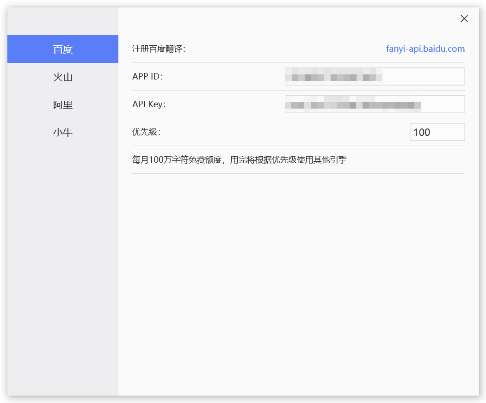
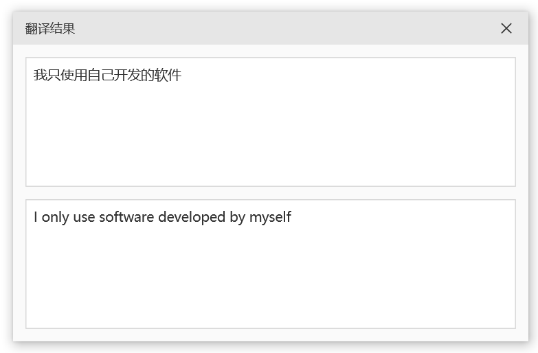

桌面翻译工具（仅1MB）支持快捷键取词

继发布桌面截图工具（仅2MB）之后，我又开发了一个桌面翻译工具：

**Translator**

开源地址：https://github.com/xland/Translator

Translator 一个小巧的桌面翻译工具。

## 用法

需要先注册一个在线翻译服务

目前已接入百度翻译：[fanyi-api.baidu.com](https://fanyi-api.baidu.com/) （每月100万免费字符额度）

注册完成后把得到的 `APP ID` 和 `API Key` 设置到本应用中。

如下图所示：

之后，当你选中文本后，按下 `Ctrl+Alt+T` 即可得到翻译结果（你可以在设置界面修改快捷键）。

程序会自动识别你选中的文本，

如果你选中的文本中包含中文字符，则会翻译成英文，

如果你选中的文本中没有中文字符，则会翻译成中文。

